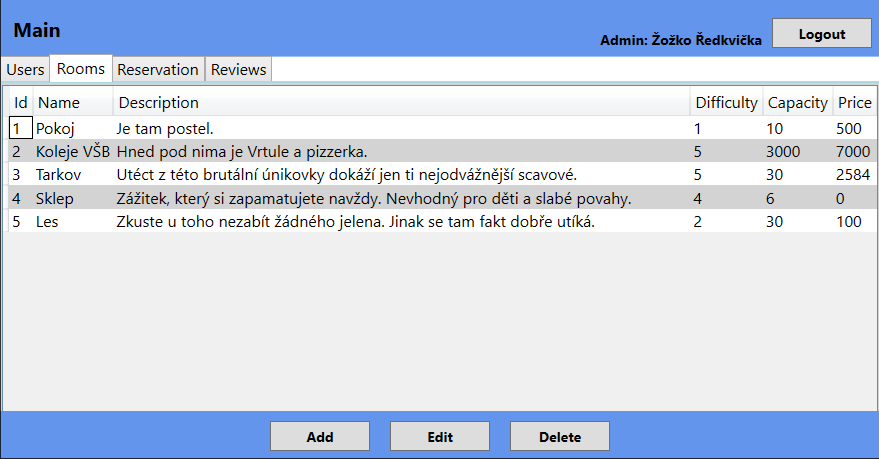
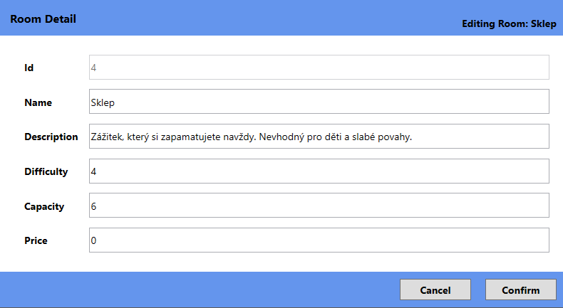
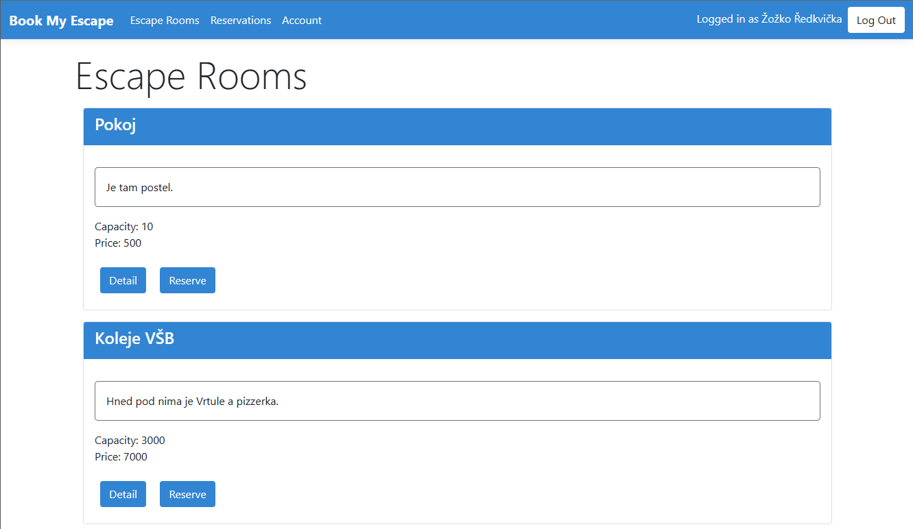

# Escape room reservation project for C#2

## Description

The aim of this project is to create a simple escape room reservation system and learn some C# along the way. 

## Data layer

- Custom Database client for basic CRUD operations.
- Built with SQLite, if you want to use any other SQL database, the code will have to be refactored.
- Everything is made using reflection - very nice.

## Desktop application

- Desktop app made using WPF.
- Used for users with admin access.
- Allows basic work with the current database - adding, edititng and removing entries.
- All of the windows are created generically and are not bound to the existing database entities.
- Not made using Maui because it's pay to win.

## Web application

- Web app made using ASP.NET Core.
- Used for customers.
- Allows overview of available escape rooms and their reviews for unregistered users.
- Users with an account can reserve rooms and leave reviews for their reservations.
- They can also export their reservations as a JSON.
- Logged in user is stored in a singleton, so only one client can be logged in at a time.
	- This is a very bad idea, but i find it funny.
- Sadly no dark theme because my bootstrap is outdated.

